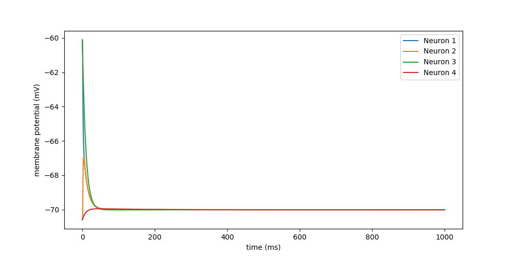
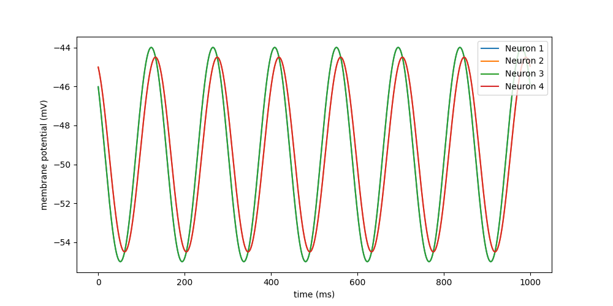

### **Code Availability**
All simulation scripts and test code used for this report are available at [gap_tester.ipynb](https://github.com/FrassettoN/io-gap-junctions-network/blob/main/nestml_gap_junctions/gap_tester.ipynb)
## **Testing Protocol**

*Neuron Models*
- `eglif_cond_alpha_multisyn` (EGLIF)  
- `aeif_cond_exp_neuron` (AdEx)  

*Network Setup*
Four neurons in total:
  - Neurons 1 & 2: coupled via a gap junction  
  - Neurons 3 & 4: uncoupled (control group)  

*Initial Conditions*
- Neuron 1 & 3: initialized at -46 mV
- Neuron 2 & 4: initialized at -45 mV
- Only for EGLIF: parameters chosen to reproduce the subthreshold oscillatory regime.

*Validation Method*
1. Record membrane voltage traces for all four neurons.  
2. Compare traces programmatically:  
	- Use `np.allclose(trace_a, trace_b, atol=1e-9)`
3. Validate expected outcomes:  
	- Coupled neurons (1 & 2): dynamics should reflect electrical coupling.  
	- Uncoupled neurons (3 & 4): independent evolution, serving as baseline.   
4. Spiking Analysis

<div style="page-break-after: always;"></div>

### **Subthreshold Regime without Input**

<u>AdEx</u>

Converging traces show correct gap junction behavior.
```
V_m of cell 1 and cell 3 are equal: False 
V_m of cell 2 and cell 4 are equal: False
```

<div style="page-break-after: always;"></div>

<u>EGLIF</u>

Overlapping traces show no coupling
```
V_m of cell 1 and cell 3 are equal: False 
V_m of cell 2 and cell 4 are equal: False
```

<div style="page-break-after: always;"></div>

### **Subthreshold Regime with DC Input on one neuron**

DC Input:
- For the entire simulation
- On neurons 1 and 3
- Different stimulation intensity to avoid spiking
	- +100 pA for AdEx
	- +10 pA for EGLIF

<u>AdEx</u>

```
V_m of cell 1 and cell 3 are equal: False 
V_m of cell 2 and cell 4 are equal: False
```

<div style="page-break-after: always;"></div>

<u>EGLIF Voltage Trace</u>

```
V_m of cell 1 and cell 3 are equal: True 
V_m of cell 2 and cell 4 are equal: True
```

<div style="page-break-after: always;"></div>

### **Subthreshold regime with DC Input on both neurons**

DC Input:
- For the entire simulation
- On all neurons
- Different stimulation intensity to avoid spiking
	- +100 pA for AdEx
	- +10 pA for EGLIF

<u>AdEx</u>

```
V_m of cell 1 and cell 3 are equal: False 
V_m of cell 2 and cell 4 are equal: False
```

<div style="page-break-after: always;"></div>

<u>EGLIF</u>

```
V_m of cell 1 and cell 3 are equal: True 
V_m of cell 2 and cell 4 are equal: True
```

<div style="page-break-after: always;"></div>

### **Spiking regime for one neuron**
DC Input:
- For the entire simulation
- On neurons 1 and 3
- Different stimulation intensity to induce spiking
	- +1200 pA for AdEx
	- +40 pA for EGLIF

<u>AdEx</u>

```
V_m of cell 1 and cell 3 are equal: False 
V_m of cell 2 and cell 4 are equal: False
```


<div style="page-break-after: always;"></div>

<u>EGLIF</u>

```
V_m of cell 1 and cell 3 are equal: False 
V_m of cell 2 and cell 4 are equal: True
```


<div style="page-break-after: always;"></div>

### **Spiking regime for both neurons**

DC Input:
- For the entire simulation
- On all neurons
- Different stimulation intensity to  induce spiking
	- +1200 pA for AdEx
	- +40 pA for EGLIF

<u>AdEx</u>

```
V_m of cell 1 and cell 3 are equal: False 
V_m of cell 2 and cell 4 are equal: False
```


<div style="page-break-after: always;"></div>

<u>EGLIF</u>

```
V_m of cell 1 and cell 3 are equal: False 
V_m of cell 2 and cell 4 are equal: False
```

#### **Spiking Analysis**
- **AdEx model:** When both cells are stimulated, the firing rate of the first neuron is higher than when it is stimulated alone while connected by the gap junction. However, this firing rate remains lower than that of neurons without gap junction connections.
- **EGLIF model:** When both cells are stimulated, the firing rate of the first neuron is the same as when it is stimulated alone.